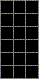
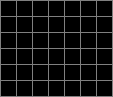

# DRLA Simulator

Trains a deep reinforcement learning agent in simulation testbed environments with the [DRLA](https://github.com/benborder/drla) library.

  

The following environments are available:

- [x] Cart Pole
- [x] Tic Tac Toe
- [x] Connect Four
- [ ] Grid World (WIP)

## Building and Using

Install libtorch at `/usr/local/libtorch` and ensure cmake is also installed.

```bash
cmake --preset release
cmake --build --preset release --target install --parallel 8
```

### Dependencies

All below dependencies are fetched automatically via cmake fetch content.

- [drla](https://github.com/benborder/drla)
- [nlohmann-json](https://github.com/nlohmann/json)
- [spdlog](https://github.com/gabime/spdlog)
- [cxxopts](https://github.com/jarro2783/cxxopts)

## Training

To run training pass the config json file and the path to store the training data:

```bash
../install/drla-sim/bin/sim_train --config /path/to/config.json --data /path/to/data/directory/
```

An example config for connect4 can be found [here](doc/config-example-c4.jsonc).

## Monitoring training

Run [Tensorboard](https://github.com/tensorflow/tensorboard) to view current and previous training runs:

```bash
tensorboard --max_reload_threads 4 --load_fast=false --bind_all --logdir /path/to/data/directory/
```

Goto http://localhost:6006 to view webpage.

## Running an agent

A trained agent can be run via:

```
../install/drla-sim/bin/sim_run --data /path/to/data/directory/
```
